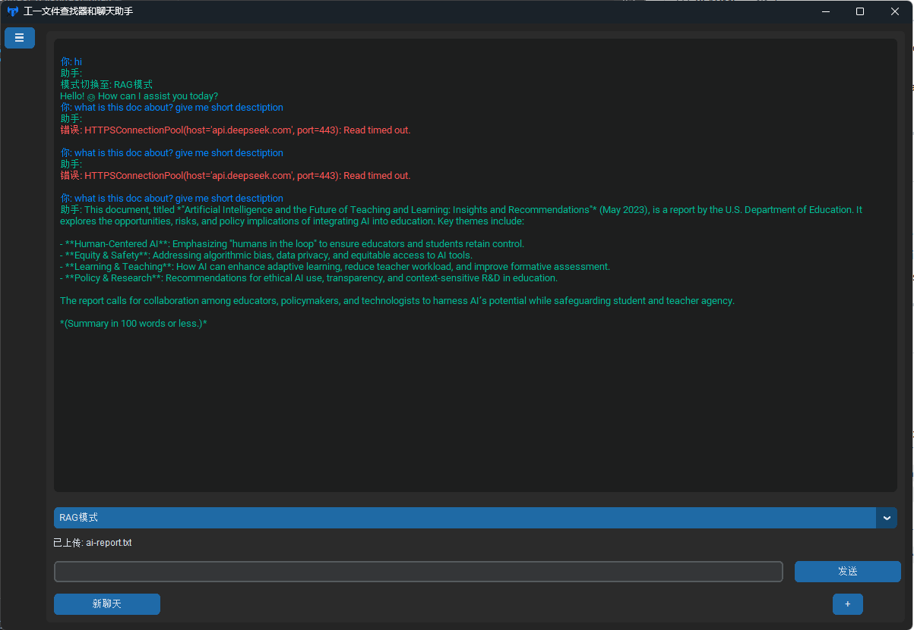

# FileFinder

**Smart File Finder & Chat Assistant** is a Python-based desktop application designed to help users efficiently search, manage, and summarize documents and images. Leveraging advanced AI capabilities, including text and image embeddings, OCR (Optical Character Recognition), and natural language processing, this tool provides a seamless experience for organizing and retrieving information from files stored locally or on network drives.

Built with `customtkinter` for a modern GUI, `Flask` for the API backend, and integrated AI models like SentenceTransformers and ChineseCLIP, FileFinder is a powerful utility for professionals, researchers, and anyone dealing with large collections of files.

---

## Features

- **File Search**: Search documents (DOCX, XLSX, PPTX, PDF, TXT) and images (JPG, PNG, GIF, BMP) using natural language queries.
- **AI-Powered Embeddings**: Uses text and image embeddings for semantic search, powered by SentenceTransformers and ChineseCLIP.
- **OCR Integration**: Extracts text from images and PDFs with embedded images using Tesseract OCR via an API.
- **Summarization**: Generates AI-driven summaries of documents and OCR-extracted text from images using a chat API.
- **Multi-Language Support**: Supports English and Chinese (ZH) interfaces.
- **Dark/Light Mode**: Toggle between dark and light themes for a comfortable user experience.
- **System Tray**: Minimizes to the system tray with hotkey support (`Alt+Q`) to restore the window.
- **Continuous Indexing**: Automatically updates the file index in the background to reflect changes in monitored directories.

---

## Screenshots

*(Add screenshots here once you have them, e.g., search interface, chat window, summary popup)*

- Search Tab: 
- Chat Assistant: 
- OCR Summary: 

---

## Installation

### Prerequisites

- **Python**: 3.8 or higher
- **Tesseract OCR**: Required for OCR functionality
  - Windows: [Download](https://github.com/UB-Mannheim/tesseract/wiki) and add to PATH
  - Linux: `sudo apt install tesseract-ocr`
  - macOS: `brew install tesseract`
- **Poppler**: Required for PDF-to-image conversion
  - Windows: [Download](https://github.com/oschwartz10612/poppler-windows) and add to PATH
  - Linux: `sudo apt install poppler-utils`
  - macOS: `brew install poppler`

### Setup

1. **Clone the Repository**:
   ```bash
   git clone https://github.com/BotirBakhtiyarov/Filefinder.git
   cd Filefinder
   ```

2. **Create a Virtual Environment**:
   ```bash
   python -m venv .venv
   source .venv/bin/activate  # Linux/macOS
   .venv\Scripts\activate     # Windows
   ```

3. **Install Dependencies**:
   ```bash
   pip install -r requirements.txt
   ```

4. **Configure Models**:
   - Update the `MODEL_DIR` path in `api_server.py` to point to your local model directory:
     ```python
     MODEL_DIR = "models/"  # Adjust this path
     ```
   - Ensure the models (`paraphrase-multilingual-MiniLM-L12-v2` and `chinese-clip-vit-base-patch16`) are available in that directory or downloaded automatically by the libraries.

5. **Run the API Server**:
   ```bash
   python api_server.py
   ```

6. **Run the Application**:
   ```bash
   python app.py
   ```

---

## Usage

1. **Initial Setup**:
   - On first launch, a setup wizard will prompt you to configure:
     - API URL and Key (for embeddings)
     - Chat API URL and Key (for summarization)
     - Document and Image directories to monitor
     - Language (EN/ZH) and theme (Dark/Light)

2. **Search Files**:
   - Go to the "Search" tab.
   - Enter a query (e.g., "annual report summary").
   - View results for documents and images with options to:
     - **Open**: Opens the file in the default application.
     - **Summary**: Displays an AI-generated summary (documents only).
     - **OCR Summary**: Extracts text from images and summarizes it.

3. **Chat Assistant**:
   - Switch to the "Chat" tab.
   - Ask questions or request summaries directly via the chat interface.

4. **Minimize to Tray**:
   - Close the window to minimize to the system tray.
   - Press `Alt+Q` to restore the window.

---

## Project Structure

```
FileFinder_final/
├── .venv/              # Virtual environment
├── assets/
│   ├── ui/             # GUI components
│   │   ├── chat_frame.py
│   │   ├── main_app.py
│   │   ├── search_frame.py
│   │   ├── setup_wizard.py
│   │   └── summary_window.py
│   └── utils/
│       └── file_utils.py  # File handling utilities
├── app.py             # Main application entry point
├── api_server.py      # Flask API server for embeddings and OCR
├── requirements.txt   # Python dependencies
└── myicon.ico         # Application icon
```

---

## API Endpoints

The `api_server.py` provides the following endpoints:

- **`/embed_text`**: Embeds text for semantic search.
- **`/embed_image`**: Embeds images for search.
- **`/embed_clip_text`**: Embeds text for CLIP-based image search.
- **`/extract_pdf_with_ocr`**: Extracts text from PDFs (including images) using OCR.
- **`/extract_image_ocr`**: Extracts text from individual images using OCR.

---

## Contributing

Contributions are welcome! To contribute:

1. Fork the repository.
2. Create a feature branch (`git checkout -b feature/YourFeature`).
3. Commit your changes (`git commit -m "Add YourFeature"`).
4. Push to the branch (`git push origin feature/YourFeature`).
5. Open a Pull Request.

Please ensure your code follows PEP 8 style guidelines and includes appropriate tests.

---

## Troubleshooting

- **FileNotFoundError**: Ensure file paths are correct and accessible. Network drives must be mapped or properly resolved.
- **UnicodeDecodeError**: The app handles multiple encodings (UTF-8, UTF-16, Latin-1) for TXT files. Add more encodings in `file_utils.py` if needed.
- **OCR Issues**: Verify Tesseract and Poppler are installed and in your system PATH.
- **API Errors**: Check that `api_server.py` is running and the API URL/key are correctly configured in the app.

---

## Acknowledgments

- [CustomTkinter](https://github.com/TomSchimansky/CustomTkinter) for the modern GUI framework.
- [SentenceTransformers](https://github.com/UKPLab/sentence-transformers) for text embeddings.
- [Transformers](https://github.com/huggingface/transformers) for CLIP models.
- [Tesseract OCR](https://github.com/tesseract-ocr/tesseract) for text extraction.
